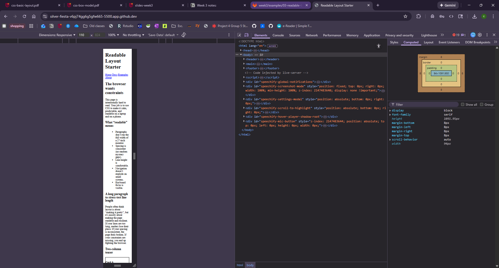

# 03-readable-layout-starter

This example is intentionally “ugly”. Your job is to make it readable.

## Tasks (suggested order)

1) Add a baseline:
- sensible font stack
- `line-height`

2) Constrain line length:
- apply a `max-width` to the main content
- center it with `margin: 0 auto`
- add `padding`

3) Normalize spacing:
- remove surprise default margins (then add your own deliberately)

4) Add one responsive behavior:
- make the teaser cards become columns on wider screens
- keep them stacked on narrow screens

5) Make focus visible:
- add `:focus-visible` styles for links and inputs

## DevTools checklist

- Use Computed → Box Model to confirm margin/padding.
- Verify your `max-width` is applied to the intended container.

## Questions and Answers:

1) Your design goals for the updated project
My main goal was to make the page easier and more comfortable to read by improving the font, spacing, and layout. I wanted to avoid long lines of text, keep everything centered, and make sure the page looked clean and organized on both large and small screens.

2) The 3 biggest layout changes you made
First, I added a maximum width to the main content and centered it so the text does not stretch across the entire screen. I removed default margins and added consistent spacing between sections to make the layout feel more intentional. Then, I added padding to the header, main content, and footer so the content is not too close to the edges of the screen.

3) What responsive behavior you implemented
I made the navigation wrap and become stacked on smaller screens using a media query. This helps keep the links readable and prevents them from overflowing on mobile-sized screens.

4) Include your before/after screenshots (JPEG/PNG files)
Before:

After: 

5) One DevTools insight you used (Styles/Computed)
I used Chrome DevTools and checked the Computed tab and Box Model to make sure my padding, margins, and max-width were being applied correctly. This helped me confirm that the layout changes were working as intended and that no default styles were interfering.
